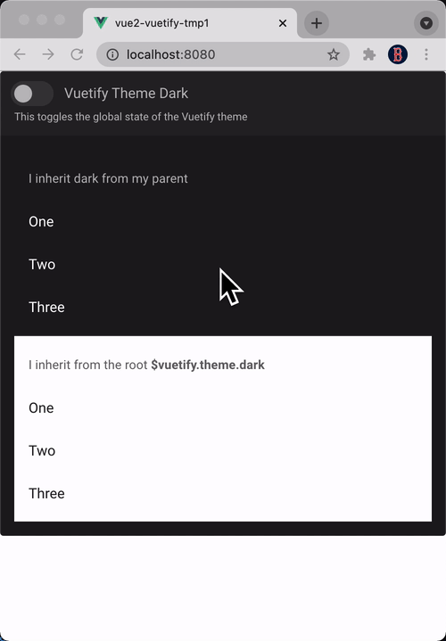

> Demonstrates setting oversscroll color to match Vuetify theme

https://stackoverflow.com/q/68533379/6277151

The overscroll color (the background color of the window seen when overscrolling the main window) is set by the `<body>`'s background color. To match the current Vuetify theme, use a watcher on `$vuetify.theme.isDark` that sets the body's background color to match:

1. Add a template ref to the v-app component (named "app"):

    ```html
    <v-app ref="app">
    ```

2. Add a watcher on Vuetify's $vuetify.theme.isDark property that copies the v-app's background color to the body:

    ```js
    export default {
      watch: {
        '$vuetify.theme.isDark'() {
          this.$nextTick(() => {
            const rootStyles = window.getComputedStyle(this.$refs.app.$el)
            document.body.style.backgroundColor = rootStyles.backgroundColor
          })
        }
      }
    }
    ```


